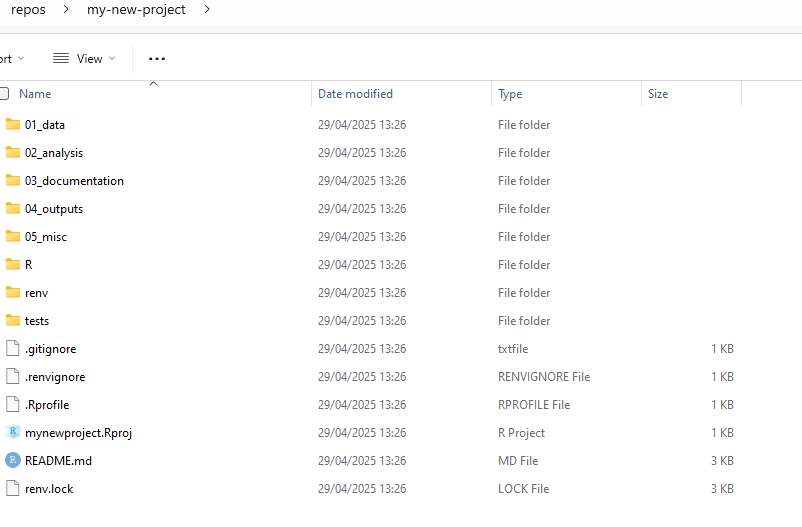

```{r, include = FALSE}
knitr::opts_chunk$set(
  collapse = TRUE,
  comment = "#>"
)
```

```{r setup, include =  FALSE}
library(dfeR)
library(knitr)
```

---
title: "Creating a new dfeR project"
output: rmarkdown::html_vignette
vignette: >
  %\VignetteIndexEntry{create_new_project}
  %\VignetteEngine{knitr::rmarkdown}
  %\VignetteEncoding{UTF-8}
---

```{r, include = FALSE}
knitr::opts_chunk$set(
  collapse = TRUE,
  comment = "#>"
)
```

## Introduction and prerequisites

The dfeR package can be used to create a new R project using the `create_project()` function. This function helps you set up a pre-populated project with a custom folder structure, making it easier to start your analysis or publication. In order to use this function, you will need to ensure you have the right software installed, and have an understanding of R projects and renv.

If you are familiar with all of the above, you can go to the [Using the `create_project()` function](#using-the-create_project-function) section of this page or the [`create_project()` reference](https://dfe-analytical-services.github.io/dfeR/reference/create_project.html) for an overview of the usage, arguments and examples.

### Pre-requisites

Before you begin, ensure you have the following installed.

-   R for Windows (x64) - version 4.0.0 or higher 
-   RTools (for Windows users and the version must match the R version)
-   RStudio
-   The dfeR package

See the information below for installing if you don't have these already.

### What is RStudio?

RStudio is an integrated development environment (IDE) for R. It provides a user-friendly interface for writing and running R code, managing files, and visualising data. You can download R (language) and RStudio (IDE) from the DfE software center. You also must download RTools (a helpful R extension) at the same time to use renv.

### How do I install dfeR?

dfeR is available on CRAN and you can install directly from there by typing the below code into the console window in R studio:

```{r install_dfer, eval = FALSE}
install.packages("dfeR")
```

The [dfeR documentation](https://dfe-analytical-services.github.io/dfeR/index.html) gives more details on options for installing.

### What is an R project?

An R project is a working directory designated for a specific analysis or project. It keeps all your scripts, data, functions and outputs together in one place. Rstudio allows you to switch between your projects easily, meaning you can keep your different pieces of work separate from each other.

Whenever you are using R studio, you should work in an R Project. This makes sure you are set up in the correct working directory, so your code is pointing at the right folders and files. You can find out more in [this guide for using projects in R](https://support.posit.co/hc/en-us/articles/200526207-Using-RStudio-Projects).

### What is renv?

Packages and versions of R regularly update. Over time, this can cause code to break - e.g. if different dependencies are required for later versions of packages to work. Using renv creates a “snapshot” of your code and packages at the time you created it, which anyone can then recreate when they come to use your code. This means that you can be sure that the code you wrote will work in the future, even if packages are updated.

You should use the renv package for package version control in R. It creates a project-specific library, meaning that installing a new or updated package for one project won't break your other projects. This is particularly useful for reproducibility and collaboration, as it ensures that your project will work with the same package versions on different machines. You can find out more about renv on the [Analysts' Guide](https://dfe-analytical-services.github.io/analysts-guide/learning-development/r.html#renv).

### What is testthat?

`testthat` is an R package that helps you write and run tests to ensure your code works correctly. It allows you to create tests that check if your functions produce the expected results, run these tests to catch errors early, and gives you confidence that your code is reliable and behaves as intended. It's a valuable tool for maintaining high-quality, bug-free code.

See the [coffee and coding resources](https://educationgovuk.sharepoint.com/sites/sarpi/g/WorkplaceDocuments/Induction%20learning%20and%20career%20development/Coffee%20and%20Coding/190306_peter_autotesting?csf=1&web=1&e=F945Xq&CID=bb26da68-5589-4c82-9892-7fb3b7adf1eb) or this [guide on testing](https://r-pkgs.org/testing-basics.html) by Hadley Wickham for getting started.

### What is a GitHub .gitignore file?
A .gitignore file is a text file that tells Git which files or directories to ignore in a project. It helps you avoid committing sensitive information, temporary files, or other unnecessary files to your Git repository. By creating a .gitignore file, you can keep your repository clean and focused on the essential files needed for your project. Find more guidance on how to avoid revealing sensitive information on the [Analysts' Guide](https://dfe-analytical-services.github.io/analysts-guide/RAP/rap-statistics.html#avoid-revealing-sensitive-information). 

## Using the `create_project()` function

The create_project function is a part of the dfeR package and is used to create a new R project with a custom folder structure. It is designed to help you set up your project quickly and efficiently, with all the necessary components in place. 

The function works by:

1.  **Setting up the core project structure** The core project structure will either create an ad-hoc project folder structure, which includes folders for data, analysis and output, or a larger folder structure for publication projects, which includes more folders for different data, analysis, documentation and outputs.

2.  **Adding initial files** The script creates some initial files, such as a template README file to help you get started with your project. It also initialises the `testthat` package, which is used for unit testing in R.

3.  **Customisation** The project creates a GitHub .gitignore file if set to `TRUE` and initialises the `renv` package if set to `TRUE`.

Here is the basic code you will need to use, having installed dfeR:

```{r create_project, eval = FALSE}
dfeR::create_project(
  path = "C:/path/to/your/new/project",
  init_renv = TRUE,
  include_structure_for_pkg = FALSE,
  create_publication_proj = FALSE,
  include_github_gitignore = TRUE
)
```

### Where to save your project 

You should store any projects that use Git outside of OneDrive. To create a folder in your C drive, type: 'C:/Users/username' into the file explorer search bar and create a folder called 'repos'.

### Parameters

Below is a table describing the parameters used within the code. When using the create_project function, you will need to make a decision on what to enter for each in order to create the appropriate type of project.

```{r, echo = FALSE}
parameter_data <- data.frame(
  Parameter = c(
    "Path",
    "init_renv",
    "include_structure_for_pkg",
    "create_publication_proj",
    "include_github_gitignore"
  ),
  Meaning = c(
    "Folder pathway",
    "Initiate renv in the project",
    "Additional folder for package development",
    "Create project with structure for publications",
    "Include a GitHub .gitignore file"
  ),
  `Expected input` = c(
    "A folder path e.g. 'C:/Users/username/repos'",
    "Boolean (TRUE/FALSE), default = TRUE",
    "Boolean (TRUE/FALSE), default = FALSE",
    "Boolean (TRUE/FALSE), default = FALSE",
    "Boolean (TRUE/FALSE)"
  ),
  Considerations = c(
    "Where do you want to store your project?",
    "Do you want to use renv for package version control?",
    "Are you creating this project to work on a package?",
    "Should the folder structure be for a publication project?",
    "Do you want to exclude certain files from being tracked by Git?"
  ),
  Output = c(
    "This will be the folder your new project is created within.",
    "If set to TRUE, renv will be initialised in your project.",
    "If set to TRUE, an additional package development folder will be created",
    "If set to TRUE, extra publication specific folders will be created",
    "If set to TRUE, a GitHub .gitignore file will be created."
  )
)


kable(
  parameter_data,
  format = "markdown",
  col.names = c("Parameter", "Meaning", "Expected input",
                "Considerations", "Output")
)
```

You will also need to think about what you want your project to be called and include this in your file path. You can always amend this later.

For example, if you want to create a project called “my-new-project” in the folder you created above, your file path (with the username changed to your username) would be "C:/Users/Msmith/repos/my-new-project".

You can create a project in a different location, but you will need to change the file path accordingly.

### Example

```{r function_example, eval = FALSE}
# Load the dfeR package
library(dfeR)
# Create a new project with the desired parameters
dfeR::create_project(
  path = "C:/Users/MSmith/repos/my-new-project",
  init_renv = TRUE,
  include_structure_for_pkg = FALSE,
  create_publication_proj = TRUE,
  include_github_gitignore = TRUE
)
```

The above code will create a new project in the specified folder path, with renv initialised, a publication project structure, and a GitHub .gitignore file included. You can view this by going to the location of the pathway you chose in file explorer. You should find your new project there, inside a folder with the name you added at the end of your pathway, as below.

{fig-alt="Newly created contents of project folder in file explorer."}

You can then open the project by going to file \> open project in RStudio. If you have set create_publication_proj to `FALSE`, you will find your folders will look a little different to the above.

You can amend the file structure and names to suit the particular project you are working on, using the file structure created as a template.

### Troubleshooting

You may hit an error if the `init_renv` parameter is not set to FALSE. This initiates `renv` in the created project, which is best practice. However, the `renv.lock` is set up to record several packages (`rmarkdown, testthat, renv, stringr`). You may get the following error message, letting you know that none of these packages are installed:

*"None of the packages recorded in the lockfile are currently installed."*

This can be rectified by executing `'renv::restore()'` in your console which will install those packages.
